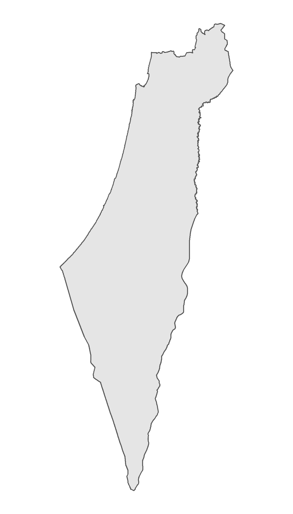
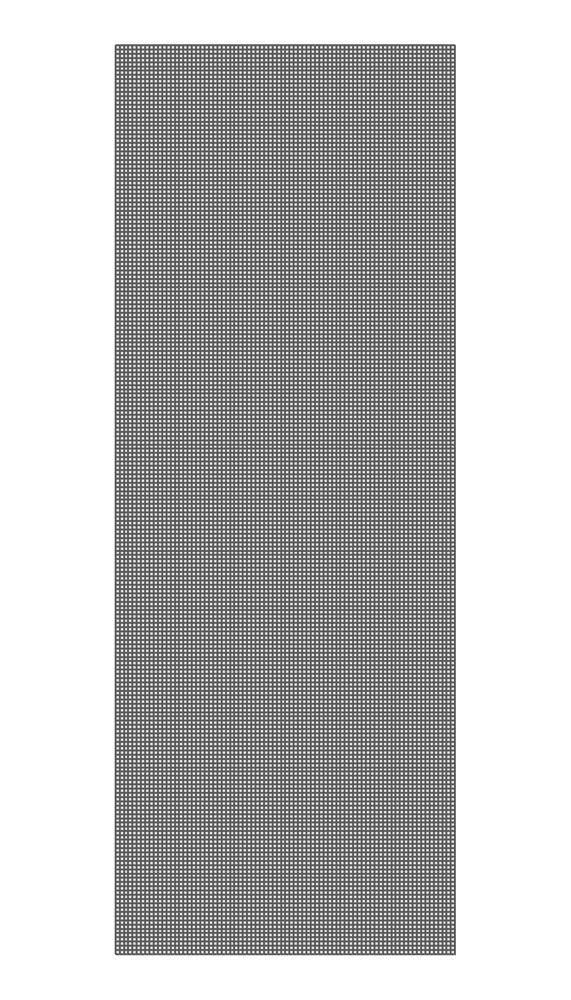
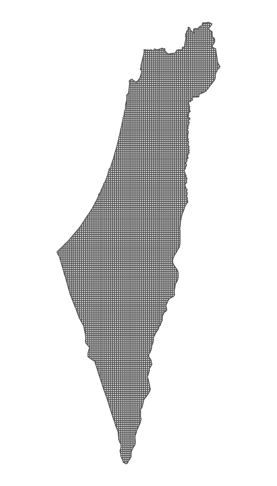
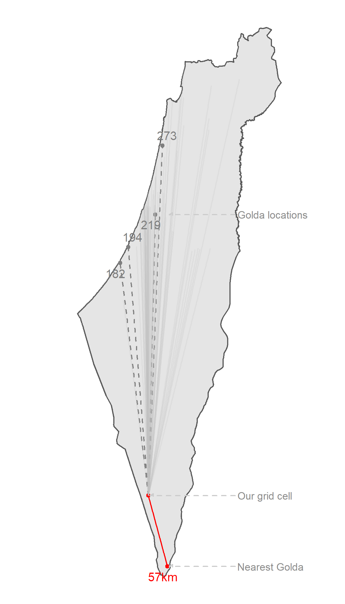
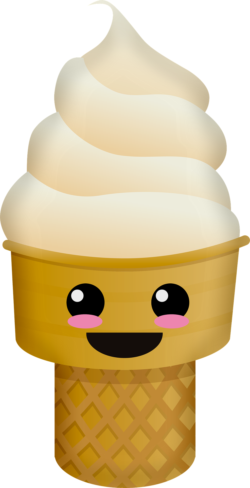

```{r echo = FALSE}
options(htmltools.dir.version = FALSE)
knitr::opts_chunk$set(
  fig.width=8, fig.height=5, fig.retina=3,
  out.width = "100%",
  cache = FALSE,
  echo = FALSE,
  message = FALSE, 
  warning = FALSE,
  fig.show = TRUE,
  hiline = TRUE
)
```

```{r xaringan-themer, include = FALSE, eval = FALSE}
library(xaringanthemer)

# Run only first time to generate the themer css 
# style_mono_accent(
#   base_color = "#3f51b5",
#   code_font_google   = google_font("Fira Mono")
# )
```

```{r}
xaringanExtra::use_tile_view()
xaringanExtra::use_freezeframe()
xaringanExtra::use_extra_styles(
  hover_code_line = TRUE         #<<
)
```


```{r}
icon_color <- "#3f51b5"
```

```{r}
library(xaringanExtra)
library(sf)
library(readr)
library(leaflet)
library(dplyr)
library(readr)
library(purrr)
library(glue)
library(htmltools)
library(ggspatial)
library(ggrepel)
library(units)
library(icons)
library(extrafont)
```

class: title-slide, center, bottom
background-image: linear-gradient(to bottom, transparent 0%, black 120%), url('img/cover.png')


# "Learning GIS with<br>ice-cream parlors"


Open Source in GIS conference &bull; June 9th, 2021

.small[ Amit Levinson &bull; [`r icon_style(fontawesome("home"), fill = "white")`](https://twitter.com/Amit_Levinson) [`r icon_style(fontawesome("github"), fill = "white")`](https://github.com/AmitLevinson) [`r icon_style(fontawesome("twitter"), fill = "white")`](https://twitter.com/Amit_Levinson) [`r icon_style(fontawesome("linkedin"), fill = "white")`](https://www.linkedin.com/in/amit-levinson/)
]

---
class: bold-last-item

# About me

--

- Sociology MA Graduate, BGU

--

- Been using R Programming language for < 2 years

--


- Had no idea what is GIS prior to using R

--

- Enjoy:

--

  - Open source tools (R, Linux, Git, MySQL)
  
--

  - Blogging
  
--

  - Learning new things

--

  - &#127850; & &#129371;

---


## "Regular" data

How I first encountered and learn to work with data:

```{r echo = TRUE}
head(iris)
```

---

## Spatial data<sup>*</sup>

How I encountered spatial data (e.g. `.shp`):

```{r include = FALSE}
Sys.setlocale("LC_ALL", "Hebrew")

shelters <- read_sf("data/shelters/shelters.shp")
```

```{r echo = TRUE, highlight.output=c(1:5, 8,9)}
head(shelters[,2])
```

.footnote[
\* To reflect my learning process, I address spatial data here as a vector format (and not, e.g., raster)
] 


???
shapefiles

---
background-image: url(https://media.giphy.com/media/kfLPQJRuivFwqGBxp3/giphy.gif)
background-size: contain


???

Gif credit: tenor.com
---

## Returning to my comfort zone

--

Used a `.csv` file instead:

```{r highlight.output=c(2)}
shelters_csv <- read_csv("data/shelters/shelters.csv")

head(shelters_csv[,2:3])
```

--

```{r}
leaflet(shelters_csv) %>% 
  addTiles() %>% 
  addCircles(radius = 4, color = "red", fill = TRUE)
```


---
class: inverse, center, middle

# Exploring distances to ice-cream parlors

---
# Background

--

- Fiddled around but never really knew what I was doing

--

- Participated in several days of the [#30Daysmapchallenge](https://github.com/tjukanovt/30DayMapChallenge)

--

- Realized it's time to learn some spatial analysis


.footnote[The talk is based on an [earlier blog post on the topic](https://amitlevinson.com/blog/exploring-ice-cream-locations/)
]

--

.center[]

.pull-left[
### Inspiration

Dominic Royé's blog post about [distances to the sea in Iceland](https://dominicroye.github.io/en/2019/calculating-the-distance-to-the-sea-in-r/)
]

--


.pull-right[
### Serendipitous resource

Michael Dorman's [Spatial data analysis workshop](https://michaeldorman.github.io/R-Spatial-Workshop-at-CBS-2021/main.html) at Israel's CBS

]

---

# Data

Where do you find ice-cream locations data?

--


---
class: bold-last-item

# Data collection

- [Scrape the data from the website](https://github.com/AmitLevinson/Datasets/blob/master/golda/golda-icecreams.R)

```{r echo = FALSE}
golda_html_raw <- readRDS("data/golda/golda_html_raw.Rds")

golda_html_raw[2]
```

--

- Clean it

--

- Geocode the data to get lat & long from addresses

--

- Reverse geocode the long & lat and verify each address.

--

Final output looked like this (total of 79 addresses):

```{r}
library(readxl)
locations_raw <- read_xlsx("data/golda/golda_locations_w_English.xlsx")

knitr::kable(locations_raw[2,])
```

???
Notice we have long and lat, it's not yet even recognized as anything spatial.

--

Discrepancies were manually verified (though I probably verified everything anyway).

---
background-image: url(img/worst_day_top.jpg)
background-size: contain
---
background-image: url(img/worst_day_full.jpg)
background-size: contain

---

## How does our data look?

```{r}
golda_locations <- read_csv("data/golda/golda_locations.csv") %>% 
  mutate(id = 1:nrow(.), .before = city)
```


```{r echo = FALSE, warning = TRUE}
make_label <- function(x, y, n){
  glue("<p style='text-align:right;font-family:Calibri;font-size:12px;'>
    <b>{x}</b></br>
  {y}<br/>
  <span style='color:#808080;'>{n}</p>") %>% 
    HTML()
}
# Create labels
ice_cream_labels <- pmap(list(golda_locations$city, golda_locations$street,golda_locations$number), make_label)
# Use an icon for points
ice_cream_icon <-  makeIcon("https://upload.wikimedia.org/wikipedia/commons/2/2c/Ice-cream-solid.svg", iconWidth = 8, iconHeight = 12)


simple_map <- leaflet(data = golda_locations) %>% 
  addTiles() %>% 
  addMarkers(data = golda_locations, icon = ice_cream_icon, label = ~ ice_cream_labels)

# htmlwidgets::saveWidget(simple_map, "data/widgets/simple_map.html")
```

.center[
<iframe src='data/widgets/simple_map.html' width = 650, height = 500></iframe>
]

???

We haven't done any manipulation yet, notice the warning message

I wanted to enable users to interact with the map so leaflet was important here (and not, for example, ggplot)

---
class: inverse, center, middle

# Some spatial manipulations


---

## Transforming

We might want to be more explicit with our spatial data:

--

**Geographic**

--

```{r echo = FALSE, highlight.output =c(5)}
golda_projected <- golda_locations %>% 
  st_as_sf(coords = c("lon", "lat"), crs = 4326)

golda_projected["geometry"][1,]
```

--

**Projected**

--

```{r echo = FALSE, highlight.output =c(5)}
golda_meters <- st_transform(golda_projected, crs = 2039)

golda_meters["geometry"][1,]
```

???
-- Essentially we might want to know what coordinate reference system were using
-- CRS as in how the coordinates in our geometries relate to the surface of the Earth.

---

## Grids

We want to calculate distances to Golda, but **from where?**

--

.column[
.center[
#### Original map


```{r eval = FALSE}
library(ggplot2)
isr_map_sf <- st_transform(st_read("data/maps/israel/israel_borders.shp", quiet = TRUE), 4326)

ggplot(isr_map_sf)+
  geom_sf()+
  theme_void()
```

]
]
--

.column[
.center[
#### Grid layout (2km<sup>2</sup>)


```{r eval = FALSE}
isr_map <- st_transform(isr_map_sf, crs = 2039)
# Make square grid in the boundaries of Israel
box_isr <- st_make_grid(isr_map,  cellsize = 2000)

ggplot(box_isr)+
  geom_sf()+
  theme_void()

ggsave("img/plots/map.png", width = 4, height = 7)
```


]
]

--

.column[
.center[
#### Israel as grid


```{r eval = FALSE}
# Note it's in crs 2039
grid <- st_intersection(new_isr, isr_map)

# Too slow to plot so we'll load images
ggplot(grid)+
  geom_sf()+
  theme_void()

ggsave("img/plots/grid_map.png", width = 4, height = 7)


```


]
]


???
The grids help overcoming the reactivity we might find in web based apps


---

## Distances

We have our grid cells, how do we identify the **nearest ice-cream location?**

--

.pull-left[

Example for 1 grid cell to several Goldas: 
```{r echo = FALSE}
# grids in wgs84
grid_wgs <- readRDS("data/maps/grid_wgs.rds")
# grids in projected
grid <- readRDS("data/maps/grid.rds")

# Create a sampled dataframe
dataum <- data.frame(
  geometry = st_geometry(golda_projected),
  location_grid = st_centroid(rep(grid_wgs[350,],nrow(golda_projected))))

# Our data points projected to a 
both_distances <- map_dfc(dataum, ~ st_transform(.x, crs = 2039)) 

```

```{r echo = TRUE, highlight.output = c(5)}
example_distances <- st_distance(x = both_distances$geometry, y = both_distances$geometry.1[1])
# Print 10:
head(set_units(example_distances, "km"), 10)
```


]

--

```{r eval=  FALSE}
sample_data <- both_distances %>% 
  map_dfc(~ st_transform(.x, crs = 4326) %>% st_coordinates(.x)) %>% 
  map_dfc(as.data.frame) %>% 
  set_names(c("golda.x","golda.y", "us.x" ,"us.y")) %>% 
  cbind(distance = map2_dbl(both_distances$geometry, both_distances$geometry.1,  st_distance),
        location_polygon = st_transform(both_distances$geometry.1, crs = 4326)) %>% 
  mutate(relevant = ifelse(distance == min(distance), "yes", "no"),
         distance = ifelse(relevant == "yes", paste0(round(distance/1000, 0), "km"), round(distance/1000, 0)))

point_labels <- data.frame(x = c(34.802,34.95968, 34.95968),
                           y = c(30.04696, 29.54952, 32.02051),
                           label = c("Example grid", "Nearest Golda", "Golda locations"))

ggplot(isr_map_sf)+
  geom_sf()+
  geom_point(data = sample_data[1:5,],mapping= aes(x = golda.x, y = golda.y, color = relevant), size = 1.2)+
  geom_sf(data = grid_wgs[350,], aes(geometry = geometry), fill = "red", color = "red")+
  geom_spatial_segment(data = sample_data[1:5,], mapping = aes(x = us.x, xend = golda.x, y = us.y, yend = golda.y, linetype = relevant, color = relevant), show.legend = FALSE, crs = 4326)+
    geom_spatial_segment(data = sample_data[-c(1:5),], mapping = aes(x = us.x, xend = golda.x, y = us.y, yend = golda.y), linetype = "solid", show.legend = FALSE, crs = 4326, color = "gray75", alpha = 0.2)+
  geom_spatial_text_repel(data = sample_data[1:5,], mapping = aes(x = golda.x,  y = golda.y, label = distance, color = relevant), crs = 4326, hjust = 0.5, size = 3.5)+
  geom_text_repel(data = point_labels, mapping = aes(x = x, y = y, label = label), xlim = c(35.5,36), point.padding = 0.1,  arrow = arrow(length = unit(0.015, "npc"), type = "closed"), segment.linetype = 8, color = "gray55", segment.color = "gray80", size = 3)+
  scale_color_manual(values = c("yes" = "red", "no" = "gray50"))+
  scale_linetype_manual(values = c("dashed","solid"))+
  xlim(34,36)+
  coord_sf(clip = "off")+
  guides(color = "none")+
  #labs(title = "Finding the nearest Golda location for each grid")+
  theme(plot.title = element_text(size = 13, hjust = 0.5))+
  theme_void()


ggsave("img/plots/grid_example.png", width = 4, height = 7)
```

--

.pull-right[

]

---

## Distances

How should we use color to represent the distance?

--


```{r}

# This is created below but also used here:
golda_distances <- readRDS("data/maps/golda_distances.rds")

golda_distances %>% 
  ggplot(aes(x = distance_km))+
  geom_histogram(bins = 50, fill = "gray65")+
  theme_minimal()+
  labs(title = "Distribution of distances to the nearest ice-cream location",
       x = "Distance (km)",
       y = "Count")+
  theme(
    text = element_text(family = "Noto Serif"),
    plot.title.position = "plot",
    plot.title = element_text(size = 14, color = "#3f51b5", face= "bold", family = "Noto Serif"),
    axis.text = element_text(color = "gray30"),
    axis.title = element_text(color = "gray30"),
    panel.grid.minor.y = element_blank(),
    panel.grid.minor.x = element_blank(),
    plot.background = element_rect(fill =  "transparent", color =  "transparent"),
    panel.background = element_rect(fill = "transparent", color =  "transparent")
  )
```


---

## Cosmetics `r icon_style(fontawesome("magic"), fill = icon_color)`

```{r eval = FALSE}

# Commented out and loaded as an rds instead. Calculate distances:
distances <- st_distance(golda_meters, st_centroid(grid)) %>% 
as_tibble()


distances <- read_rds("data/maps/distances.rds")

golda_distances <- data.frame(
  # We want grids in a WGS 84 CRS:
  us = st_transform(grid, crs = 4326),
  # Extract minimum distance for each grid
  distance_km = map_dbl(distances, min)/1000,
  # Extract the value's index for joining with the ice-cream location info
  location_id = map_dbl(distances, function(x) match(min(x), x))) %>% 
  # Join with the ice-cream table
  left_join(golda_projected, by = c("location_id" = "id"))

# saveRDS(golda_distances, "data/maps/golda_distances.Rds")

```


```{r eval = FALSE}
# Decrease size of ice-cream icons
ice_cream_icon <- makeIcon("https://upload.wikimedia.org/wikipedia/commons/2/2c/Ice-cream-solid.svg", iconWidth = 6, iconHeight = 10)

# Bin ranges for a nicer color scale
bins <- c(0,5,15,30,50,70)
# Create a binned color palette
pal <- colorBin(c("#FF1554", "#FF3C70", "#FF7096", "#FFA4BC", "#FFE5EC"), 
                domain = golda_distances$distance_km, bins = bins, reverse = TRUE)


	#ff084a
# Function to create the labels indicating distances
make_label_distances <- function(km, street, city){
  glue("
  <div style='text-align:left;'>
  You are <span style='font-size:13px;'><b>{round(km, 1)}</b></span> km from the nearest location at:</div>
  <div style='text-align:right;'>
       {street}, {city}</div>") %>% 
    HTML()}


# Create labels (better approach than the blog version)
golda_distances <- golda_distances %>% 
  mutate(popup_label = pmap(list(distance_km, street,city), make_label_distances))

# Save for easier loading below in the presentation:
# saveRDS(golda_distances$popup_label[1], "data/golda/distance_labels.rds")


full_map <- leaflet() %>% 
  addTiles() %>% 
  addMarkers(data = golda_projected, icon = ~ice_cream_icon, group = "Ice-cream locations") %>% 
  addPolygons(data = golda_distances[[1]], fillColor = pal(golda_distances$distance_km), fillOpacity = 0.8, weight =0, 
              opacity =1, color = "transparent", group = "Distances", popup = golda_distances$popup_label,
              highlight = highlightOptions(weight = 2.5, color = "#666", bringToFront = TRUE, opacity= 1),
              popupOptions = popupOptions(autoPan = FALSE,closeOnClick = TRUE, textOnly = T)) %>% 
   addLegend(pal = pal, values = (golda_distances$distance_km), opacity = 0.8, 
                         title = "Distance (Km)", position= "bottomright") %>% 
  addLayersControl(overlayGroups = c("Ice-cream locations", "Distances"),
                   options = layersControlOptions(collapsed = FALSE))

# Save the widget to use as an iframe:
# htmlwidgets::saveWidget(full_map, "data/widgets/full_map.html")
```

--

```{r}


glimpse(golda_distances)

```

--

```{r eval = FALSE, echo = TRUE}
create_label_distances <- function(km, street, city){
  glue("
  <div style='text-align:left;'>
  You are <span style='font-size:13px;'><b>`{round(km, 1)}`</b></span> km from the nearest location at:</div>
  <div style='text-align:right;'>
       `{street}`, `{city}`</div>") %>% 
    HTML()}
```

--

```{r}
distance_labels <- readRDS("data/golda/distance_labels.rds")
head(distance_labels,1)
```

---


## Et Voila

.center[
<iframe src='data/widgets/full_map.html' width = 650, height = 500></iframe>
]


---
class: inverse, center,middle

# How does this relate to open source

---

## Feedback

--


`r icons::fontawesome("thumbs-down")` Why use an irrational number (2km<sup>2</sup>)

--

`r icons::fontawesome("thumbs-down")` Don't I have anything better to blog about?

--

> Someone will always have what to say about your work


--

### Positive

--

`r icons::fontawesome("thumbs-up")` Someone using the code to look at hamburger chains across Sydney, Aus.

--

`r icons::fontawesome("thumbs-up")` Micha Silver's suggestion to use a raster approach instead of a vector one

--

???
- The person trying the hamburger plot was using the 2039, but that's the one for Israel!

- Micha provided the code for using a raster approach. I was and currently barley am familiar with raster, but this definitely opens up new avenues and glad to have received that feedback.


---

## Personal reasons

--

- GIS was available in an already used OS platform (R)

--

- Free

--

- Can use/change others' code freely

--

- Pushes to high standards knowing others see/read your code

--

- Get to contribute back

---
class: inverse, center, middle

# Thank you!


