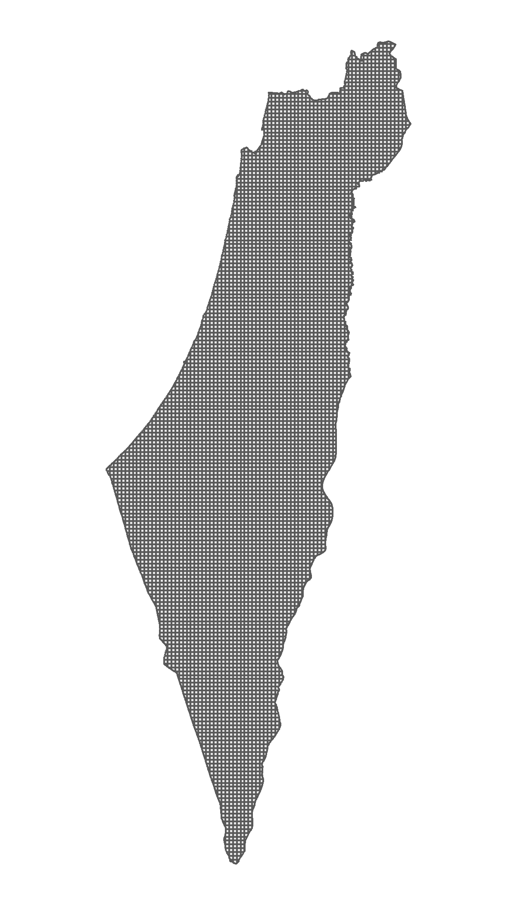
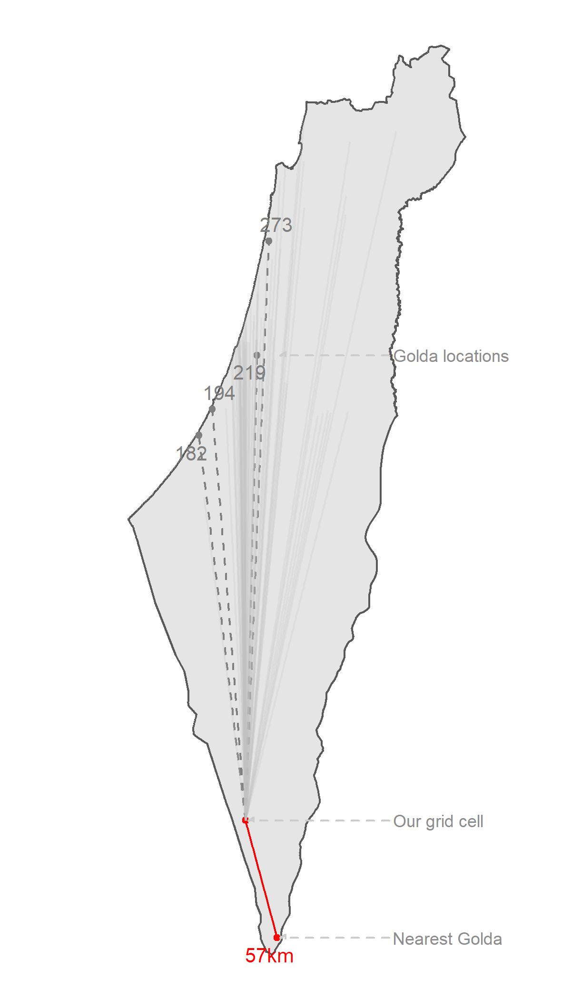

```{r echo = FALSE}
options(htmltools.dir.version = FALSE)
knitr::opts_chunk$set(
  fig.width=9, fig.height=6, fig.retina=3,
  out.width = "100%",
  cache = FALSE,
  echo = FALSE,
  message = FALSE, 
  warning = FALSE,
  fig.show = TRUE,
  hiline = TRUE
)
```

```{r}
library(xaringanExtra)
library(sf)
library(readr)
library(leaflet)
library(dplyr)
library(readr)
library(purrr)
library(glue)
library(htmltools)
library(ggspatial)
library(ggrepel)
library(units)

```

name: title-slide

.footnote[Add a nice cover image and info about me]

# "Learning GIS through mapping ice-cream parlers"

9.6.2021

"Open Source in GIS conference"
.small[Organized by Lior Kaplan]

Amit Levinson

[amitlevinson.com](https://www.amitlevinson.com)

Twitter icon | Linkedin Icon | GitHub Icon


---
# About me

- Sociology MA Graduate

- Been using R Programming lanugade for < 2 years

- Enjoy open source tools (Linux, Git, MySQL)

- Had no idea what is GIS prior to using such tools

- Big fan of cookies & milk

---

# Objectives for today


- Explore some of my initial attempts at spatial data

- Unravel my recent project as dive into GIS

- **Why is all this related to open source**

---
## How I first encountered data

```{r echo = FALSE}
head(iris)
```

---

## How I encountered ~spatial~ data.fn[1] (.shp)

```{r include = FALSE}
Sys.setlocale("LC_ALL", "Hebrew")

shelters <- read_sf("data/shelters/shelters.shp")
```

```{r echo = TRUE, highlight.output=c(1:5, 8,9)}
head(shelters[,2])

```

[1] For the sake of simplicity and to reflect my learning process, I address spatial data here as a vector format (and not, for example, raster).


???
Fix foot note

---
background-image: url(https://media.giphy.com/media/kfLPQJRuivFwqGBxp3/giphy.gif)
background-size: contain


???

Gif credit: tenor.com
---

## Using long & lat instead (.csv)

```{r highlight.output=c(2)}
shelters_csv <- read_csv("data/shelters/shelters.csv")

head(shelters_csv[,2:3])
```

```{r}
leaflet(shelters_csv) %>% 
  addTiles() %>% 
  addCircles(radius = 4, color = "red", fill = TRUE)
```

???

Fix up highlighting the column

---

## It's time to to learn some GIS

- Tried some additional attempts in the #30daysmapchallenge

- Fiddled around and sometimes hit home

- Realized it's time to get my hand dirty in some spatial data


---
class: inverse, center, middle

# Exploring distances and ice-cream parlors

---
# Background

.pull-left[
### Inspiration

Dominic Royé's blog post about [distances to the sea in Iceland](https://dominicroye.github.io/en/2019/calculating-the-distance-to-the-sea-in-r/)
]

.pull-right[
### Serendipitous resources

Michael Dorman's workshop

]

---

# Data

Where do you find Golda's ice-cream locations?

--


---

# Data collection

- [Scrape the data from the website](https://github.com/AmitLevinson/Datasets/blob/master/golda/golda-icecreams.R)

```{r echo = FALSE}
golda_html_raw <- readRDS("data/golda/golda_html_raw.Rds")

golda_html_raw[2]
```

--

- Clean it

--

- Geocode the data to get lat & long from addresses

--

- Reverse geocode the long & lat and verify each address.

--

Final output looked like this (total of 79 addresses):

```{r}
library(readxl)
locations_raw <- read_xlsx("data/golda/golda_locations_w_English.xlsx")

knitr::kable(locations_raw[2,])
```


--

Discrepancies were manually verified (though I probably verified everything anyway).

---
background-image: url(img/worst_day_top.jpg)
background-size: contain
---
background-image: url(img/worst_day_full.jpg)
background-size: contain

---

## How does our data look?

```{r}
golda_locations <- read_csv("data/golda/golda_locations.csv") %>% 
  mutate(id = 1:nrow(.), .before = city)
```


```{r echo = FALSE, warning = TRUE}
make_label <- function(x, y, n){
  glue("<p style='text-align:right;font-family:Calibri;font-size:12px;'>
    <b>{x}</b></br>
  {y}<br/>
  <span style='color:#808080;'>{n}</p>") %>% 
    HTML()
}
# Create labels
ice_cream_labels <- pmap(list(golda_locations$city, golda_locations$street,golda_locations$number), make_label)
# Use an icon for points
ice_cream_icon <-  makeIcon("https://upload.wikimedia.org/wikipedia/commons/2/2c/Ice-cream-solid.svg", iconWidth = 8, iconHeight = 12)


leaflet(data = golda_locations) %>% 
  addTiles() %>% 
  addMarkers(data = golda_locations, icon = ice_cream_icon, label = ~ ice_cream_labels)
```

???

We haven't done any manipulation yet, notice the warning message

I wanted to enable users to interact with the map so leaflet was important here (and not, for example, ggplot)


---

### Transforming

Previously leaflet recognized lat & long, but we should be more explicit and specifiy our coordinate reference systems:

--

**Geographic**

--

```{r echo = FALSE, highlight.output =c(5)}
golda_projected <- golda_locations %>% 
  st_as_sf(coords = c("lon", "lat"), crs = 4326)

golda_projected["geometry"][1,]
```

--

**Projected**

--

```{r echo = FALSE, highlight.output =c(5)}
golda_meters <- st_transform(golda_projected, crs = 2039)

golda_meters["geometry"][1,]
```


---

### Grids

We want to calculate distances, but **from where?**

--

.column[
.center[
#### Original map


```{r eval = FALSE}
library(ggplot2)
isr_map_sf <- st_transform(st_read("data/maps/israel/israel_borders.shp", quiet = TRUE), 4326)

ggplot(isr_map_sf)+
  geom_sf()+
  theme_void()
```

]
]
--

.column[
.center[
#### Grid layout (2km<sup>2</sup>)


```{r eval = FALSE}
isr_map <- st_transform(isr_map_sf, crs = 2039)
# Make square grid in the boundaries of Israel
box_isr <- st_make_grid(isr_map,  cellsize = 2000)

ggplot(box_isr)+
  geom_sf()+
  theme_void()

ggsave("img/plots/map.png", width = 4, height = 7)
```


]
]

--

.column[
.center[
#### Israel as grid


```{r eval = FALSE}
# Note it's in crs 2039
grid <- st_intersection(new_isr, isr_map)

# Too slow to plot so we'll load images
ggplot(grid)+
  geom_sf()+
  theme_void()

ggsave("img/plots/grid_map.png", width = 4, height = 7)


```


]
]


???
The grids help overcoming the reactivity we might find in web based apps


---

### Distances

--

.pull-left[

Example for 1 grids cell: 
```{r echo = FALSE}
# grids in wgs84
grid_wgs <- readRDS("data/maps/grid_wgs.rds")
# grids in projected
grid <- readRDS("data/maps/grid.rds")

# Create a sampled dataframe
dataum <- data.frame(
  geometry = st_geometry(golda_projected),
  location_grid = st_centroid(rep(grid_wgs[350,],nrow(golda_projected))))

# Our data points projected to a 
both_distances <- map_dfc(dataum, ~ st_transform(.x, crs = 2039)) 

```

```{r echo = TRUE, highlight.output = c(5)}
example_distances <- st_distance(x = both_distances$geometry, y = both_distances$geometry.1[1])
# Print 10:
head(set_units(example_distances, "km"), 10)
```


]

--

```{r eval=  FALSE}
sample_data <- both_distances %>% 
  map_dfc(~ st_transform(.x, crs = 4326) %>% st_coordinates(.x)) %>% 
  map_dfc(as.data.frame) %>% 
  set_names(c("golda.x","golda.y", "us.x" ,"us.y")) %>% 
  cbind(distance = map2_dbl(both_distances$geometry, both_distances$geometry.1,  st_distance),
        location_polygon = st_transform(both_distances$geometry.1, crs = 4326)) %>% 
  mutate(relevant = ifelse(distance == min(distance), "yes", "no"),
         distance = ifelse(relevant == "yes", paste0(round(distance/1000, 0), "km"), round(distance/1000, 0)))

point_labels <- data.frame(x = c(34.802,34.95968, 34.95968),
                           y = c(30.04696, 29.54952, 32.02051),
                           label = c("Example grid", "Nearest Golda", "Golda locations"))

ggplot(isr_map_sf)+
  geom_sf()+
  geom_point(data = sample_data[1:5,],mapping= aes(x = golda.x, y = golda.y, color = relevant), size = 1.2)+
  geom_sf(data = grid_wgs[350,], aes(geometry = geometry), fill = "red", color = "red")+
  geom_spatial_segment(data = sample_data[1:5,], mapping = aes(x = us.x, xend = golda.x, y = us.y, yend = golda.y, linetype = relevant, color = relevant), show.legend = FALSE, crs = 4326)+
    geom_spatial_segment(data = sample_data[-c(1:5),], mapping = aes(x = us.x, xend = golda.x, y = us.y, yend = golda.y), linetype = "solid", show.legend = FALSE, crs = 4326, color = "gray75", alpha = 0.2)+
  geom_spatial_text_repel(data = sample_data[1:5,], mapping = aes(x = golda.x,  y = golda.y, label = distance, color = relevant), crs = 4326, hjust = 0.5, size = 3.5)+
  geom_text_repel(data = point_labels, mapping = aes(x = x, y = y, label = label), xlim = c(35.5,36), point.padding = 0.1,  arrow = arrow(length = unit(0.015, "npc"), type = "closed"), segment.linetype = 8, color = "gray55", segment.color = "gray80", size = 3)+
  scale_color_manual(values = c("yes" = "red", "no" = "gray50"))+
  scale_linetype_manual(values = c("dashed","solid"))+
  xlim(34,36)+
  coord_sf(clip = "off")+
  guides(color = "none")+
  #labs(title = "Finding the nearest Golda location for each grid")+
  theme(plot.title = element_text(size = 13, hjust = 0.5))+
  theme_void()


ggsave("img/plots/grid_example.png", width = 4, height = 7)
```

--

.pull-right[

]

---

background-image: url("img/conspiracy.jpg")
background-size: cover
---
## Cosmetic touches <i class="fas fa-wand-magic"></i>

```{r eval = FALSE}

# Commented out and loaded as an rds instead. Calculate distances:
distances <- st_distance(golda_meters, st_centroid(grid)) %>% 
as_tibble()


distances <- read_rds("data/maps/distances.rds")

golda_distances <- data.frame(
  # We want grids in a WGS 84 CRS:
  us = st_transform(grid, crs = 4326),
  # Extract minimum distance for each grid
  distance_km = map_dbl(distances, min)/1000,
  # Extract the value's index for joining with the ice-cream location info
  location_id = map_dbl(distances, function(x) match(min(x), x))) %>% 
  # Join with the ice-cream table
  left_join(golda_projected, by = c("location_id" = "id"))

# saveRDS(golda_distances, "data/maps/golda_distances.Rds")

```


```{r eval = FALSE}
# Decrease size of ice-cream icons
ice_cream_icon <- makeIcon("https://upload.wikimedia.org/wikipedia/commons/2/2c/Ice-cream-solid.svg", iconWidth = 6, iconHeight = 10)

# Bin ranges for a nicer color scale
bins <- c(0,5,15,30,50,70)
# Create a binned color palette
pal <- colorBin(c("#FF1554", "#FF3C70", "#FF7096", "#FFA4BC", "#FFE5EC"), 
                domain = golda_distances$distance_km, bins = bins, reverse = TRUE)


	#ff084a
# Function to create the labels indicating distances
make_label_distances <- function(km, street, city){
  glue("
  <div style='text-align:left;'>
  You are <span style='font-size:13px;'><b>{round(km, 1)}</b></span> km from the nearest location at:</div>
  <div style='text-align:right;'>
       {street}, {city}</div>") %>% 
    HTML()}


# Create labels (better approach than the blog version)
golda_distances <- golda_distances %>% 
  mutate(popup_label = pmap(list(distance_km, street,city), make_label_distances))

# Save for easier loading below in the presentation:
# saveRDS(golda_distances$popup_label[1], "data/golda/distance_labels.rds")


full_map <- leaflet() %>% 
  addTiles() %>% 
  addMarkers(data = golda_projected, icon = ~ice_cream_icon, group = "Ice-cream locations") %>% 
  addPolygons(data = golda_distances[[1]], fillColor = pal(golda_distances$distance_km), fillOpacity = 0.8, weight =0, 
              opacity =1, color = "transparent", group = "Distances", popup = golda_distances$popup_label,
              highlight = highlightOptions(weight = 2.5, color = "#666", bringToFront = TRUE, opacity= 1),
              popupOptions = popupOptions(autoPan = FALSE,closeOnClick = TRUE, textOnly = T)) %>% 
   addLegend(pal = pal, values = (golda_distances$distance_km), opacity = 0.8, 
                         title = "Distance (Km)", position= "bottomright") %>% 
  addLayersControl(overlayGroups = c("Ice-cream locations", "Distances"),
                   options = layersControlOptions(collapsed = FALSE))

# Save the widget to use as an iframe:
# htmlwidgets::saveWidget(full_map, "data/widgets/full_map.html")
```

--

```{r}
golda_distances <- readRDS("data/maps/golda_distances.rds")

glimpse(golda_distances)

```

--

```{r eval = FALSE, echo = TRUE}
create_label_distances <- function(km, street, city){
  glue("
  <div style='text-align:left;'>
  You are <span style='font-size:13px;'><b>`{round(km, 1)}`</b></span> km from the nearest location at:</div>
  <div style='text-align:right;'>
       `{street}`, `{city}`</div>") %>% 
    HTML()}
```

--

```{r}
distance_labels <- readRDS("data/golda/distance_labels.rds")
head(distance_labels,1)
```


---

## Et Voila

.center[
<iframe src='data/widgets/full_map.html' width = 650, height = 500></iframe>
]


???
- Add disclaimer about my knowledge - tip of the ice
- [ ] Explore some of my initial attempts at spatial data

   - How was I used to working with data?
  
   - First attempt at plotting bomb shelters - B7 open access data
  
   - What is this column and weird data format?
  
   - Oh I know, final output
  
   - very nice and excited
 
 - 30 daymapchallenge
 
    - 1 example of population plot enhancing
    
- [ ] Unravel my recent project and what it taught me about working with GIS

  - I realized I don't know and want to learn more: What on earth are projections? What ~the hell~ is a raster? how can I manipulate polygons? What are some cool things in the {sf} library? How can we add interactivity to a map? and what should I do it on?

  - Well let's explore distances, that seems cool. Also came across Dominic's blog post.
  
  - Collecting the data using R
    - scraping
    - geocoding it
    - reverse geocoding it
    - Manually verify locations
    
  - OK, preliminary plot, so far so good.
  
  - Now for distances, but distance from where?
    - we need something 'specific'
    - Create grids, but what are grids?
    - and what proejction do I need?
  - Short break, luckily Michael published X during when I was working on it.
  
  - Got it, but what exactly occurs here?
  
    - So I published a small post on it, small wins
    - Plus, it got the most attention of a LinkedIn post so far.
    
  - So we cut Israel into grids, now what?
    - Calculate the distance for each square grid.
    - Any distance? where it's at minimum!
    - example for one grid
    - now for all grids a N * M matrix
    
  - Ok, but let's add interactivity
    - use leaflet to the polygon and colors
    - but also with some simple html & CSS we add a neat layer of interactivity
  
  - Publish
  
  - Feedback (good)
    - Email saying it helped them do X
    - an email someone liking it but suggesting an improvement! How much improved? by XX seconds.
    - Learn more about maps
    
    - Feedback (bad?)
      - Why a 2 squared km?
      - Why Golda? don't have anything else interesting to do about?
      
- [ ] How's all this related to open source
  - Not sure I would have done it if I'd still be using my previously learned propreitary software (SPSS)
  - Extending my already-known-tool to use it in maps
  - Contributing back to the community
  - FREE
  - Code is accessible to explore and manipulate
  - Expanding my repoirtere of skills

---
class: inverse, center,middle

# How does this relate to open source

---

## Feedback

--
- Someone using the code for their own project

--

- Micha Silver's comment on using a raster approach instead of a vector one

--

- Why use an irrational number 2km<sup>2</sup>

---

## Personal reasons

--

- It was available in an already used platform

--

- Free

-- 

- Use others' code easily